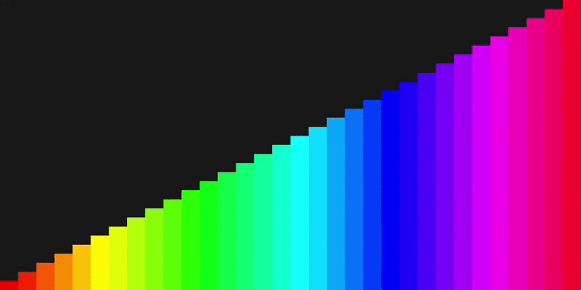

# Visualizador gráfico básico de un bubble sort

Programa sencillo para visualizar la ordenación de un array. Los métodos y funciones están parcialmente documentados, en algunos se han dejado algunos comentarios como guía.

Este programa no cuenta con opciones ni ajustes gráficos, una vez se ejecuta el programa este inicia y al cabo de 2 segundos comenzara a ordenar las barras, una vez termine de ordenarse finalizara quedando el programa corriendo, pero sin cambios en su entorno.

## Creacion del ejecutable .jar

```bash
git clone https://github.com/javiluli/basic-array-sort-visualizer.git
cd basic-array-sort-visualizer
mkdir target
javac src/Main/MainAplicacion.java -sourcepath src -d target/
jar -cvfm program.jar manifest.mf -C target/ ./
```

## Previsual


